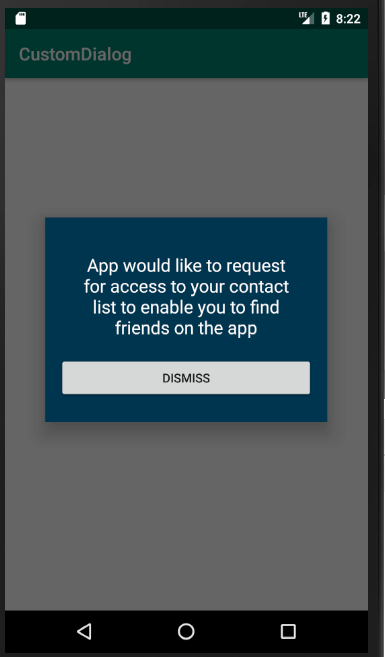

# CustomDialogBoxAndroid
The library can be used to display custom dialog boxes in Android. Developers can customize TextView text, Button Name, text color, button color, button text color and background color.

# Including library in your project

Add it in your root build.gradle at the end of repositories:

	allprojects {
		repositories {
			...
			maven { url 'https://jitpack.io' }
		}
	}

Add the dependency

	dependencies {
	        implementation 'com.github.mailkaran9:CustomDialogBoxAndroid:v1.0'
	}
	
# How to use?

FragmentManager fm = getSupportFragmentManager();
CustomFragment cf = CustomFragment.newInstance(permissionReason,buttonText,buttonColor,layoutBackgroundColor,buttonTextColor,reasonTextColor);
cf.show(fm, "fragment_edit_name");

Default values are already initialized. Developers can pass an empty string for - buttonText,buttonColor,layoutBackgroundColor,buttonTextColor,reasonTextColor

# Screenshot

